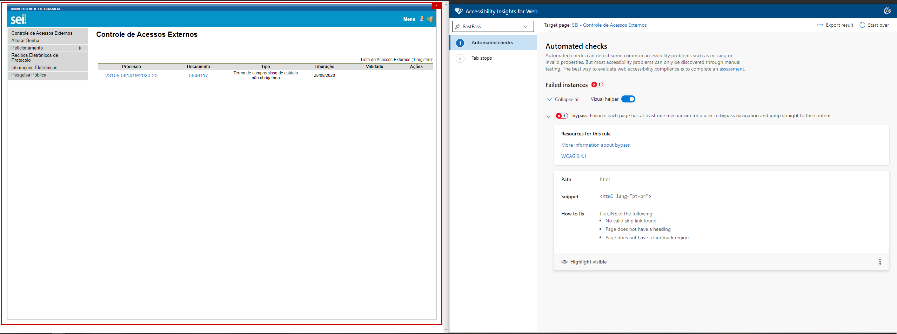
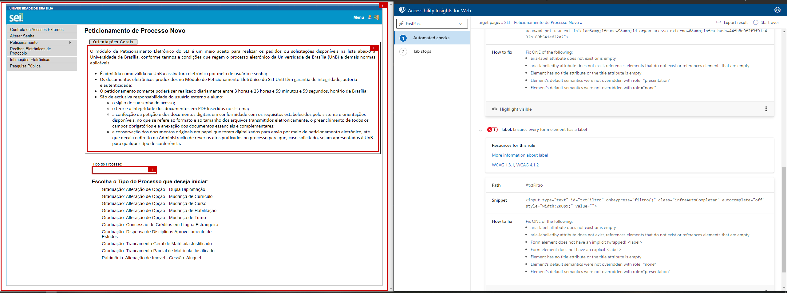
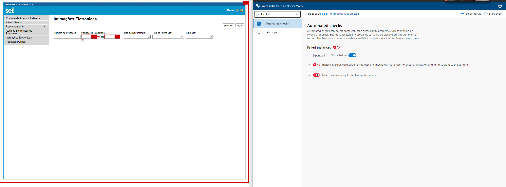
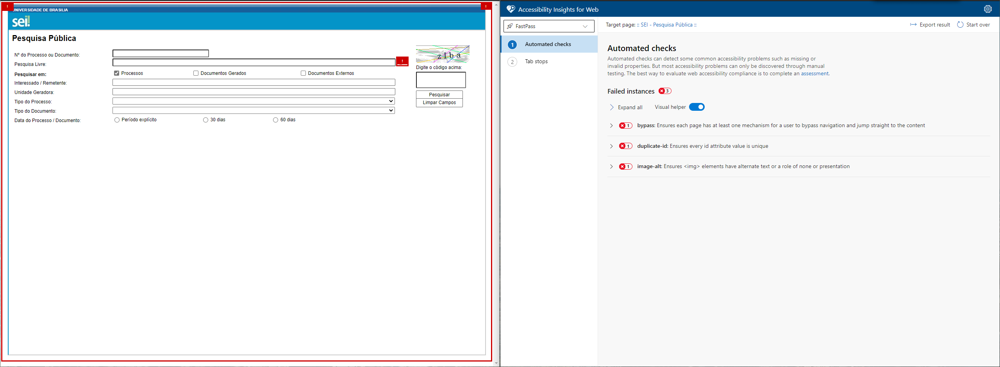

# WCAG

## Acessibilidade no contexto da Interação Humano Compuatdor

Antes de falarmos sobre acessibilidade vale a pena discutirmos sobre o que é acessibilidade. Usando a definição do [Dicionário Michaelis](http://michaelis.uol.com.br/busca?r=0&f=0&t=0&palavra=acessibilidade) temos:

    a·ces·si·bi·li·da·de
    sf
    1. Facilidade de acesso; qualidade do que é acessível.
    2. Facilidade de aproximação, de procedimento ou de obtenção.

Partindo dessa definição vale definir o que é acessível. Também pelo [Dicionário Michaelis](http://michaelis.uol.com.br/busca?r=0&f=0&t=0&palavra=acess%C3%ADvel) temos:

    a·ces·sí·vel
    adj m+f
    1.  A que se pode ter acesso; a que se pode chegar; abordável, atingível, franqueável, transitável: “O ditador tão acessível antes agora se esquivava” (LB2).
    2. Que se pode obter ou possuir; de preço módico; barato, razoável, reduzido: Mercadoria acessível.
    3. Que está ao alcance de todos; exequível, possível, realizável: Diz-se que a probidade é uma virtude acessível a todos.
    4. FIG De trato fácil; afável, comunicativo, simpático: “[…] apresentava-lhe a ‘excelente senhora’ cada vez mais pura e menos acessível!” (AA2).
    5. Que se pode entender; que não é demasiado difícil; fácil, inteligível, simples.

Usando a definição cinco e a classe gramatical temos que ser acessível é um adjetivo que caracteriza um substantivo que significa que aquele substantivo está ao **alcance de todos**. Trazendo isso para o contexto da Interação Humano Cumputador podemos definir que a acessibilidade reside na facilidade de uso de um sistema, o poder que o sistema tem de deixar suas funções ao **alcance de todos**. Portanto quando pensamos em acessibilidade temos que ter em mente o conjunto de princípios para que deficiências de visão, de coordenação motora, audição, ou qualquer outra não sejam um empecilho para que o usuário consiga utulizar o sistema.

## Então o que é esse conjunto de princípios?

Utilizando o W3C (World Wide Web Consortium) que é a comunidade internacional que define padrões de desenvolvimento web, temos o Web Content Accessibility Guidelines (WCAG) 2.0, que é um documento em que esse conjunto de princípios são definidos temos:

De maneira objetiva, o WCAG 2.0 define camadas de orientação para que os indivíduos e as organizações que seguem essas orientações sejam atendidos. Essas camadas são as seguintes :

    * Principles: Existem 4 princípios que fornecem a base para a acessibilidade na web:

        1. Perceivable: As informações e os componentes da interface do usuário devem ser apresentados aos usuários de maneira que eles os possam perceber;

        2. Operable: Os componentes da interface do usuário devem estar operáveis;

        3. Understandable: As informações e o funcionamento da interface do usuário devem ser compreensíveis;

        4. Robust: O conteúdo deve ser robusto o suficiente para que possa ser interpretado de maneira confiável por uma ampla variedade de usuários, incluindo tecnologias de assistência.

    * Guidelines: existem 12 orientações, abaixo dos princípios, que promovem as metas básicas para que o conteúdo na web seja mais acessível para usuários com diferentes deficiências;

    * Success criteria : para cada diretriz existem critérios de sucesso testáveis que seguem uma ordem de conformidade: A, AA, AAA, respectivamente do mais baixo para o mais alto.

    * Sufficient and Advisory Techniques : para cada diretriz e critério de sucesso existe uma sucessão de técnicas.

(Retirado de [Web Content Accessibility Guidelines (WCAG) 2.0](https://www.w3.org/TR/WCAG20/#intro))

## Avalição WCAG - SEI

Fazendo uso da ferramenta Accessibility Insights for Web que é uma extensão para navegadores com base chromium iremos fazer a avaliação da acessibilidade do SEI.

Figura 1: Teste de acessibilidade do atual sei  

Figura 2: Teste de acessibilidade do atual sei  

Figura 3: Teste de acessibilidade do atual sei  

Figura 4: Teste de acessibilidade do atual sei  

Através da análise feita pela Accessibility Insights podemos ver que o site possui alguns problemas de implementação que atrapalham a acessibilidade, principalmente para pessoas portadoras de deficiencia visual, uma vez que a navegação para esses usuários é feita através das labels do HTML e várias páginas não possuem labels em suas tags HTML.

## Referências

[1] [Web Content Accessibility Guidelines (WCAG) 2.0](https://www.w3.org/TR/WCAG20/#contents)

[2] [Accessibility Insights](https://accessibilityinsights.io/docs/en/android/overview/)

[3] [ How to Meet WCAG (quick reference)](https://www.w3.org/WAI/WCAG21/quickref/)

## Histórico de versões

|    Data    | Versão |      Descrição       |      Autor(es)       |
| :--------: | :----: | :------------------: | :------------------: |
| 10/09/2020 |  0.1   | Criação do documento | João Lucas Zarbiélli |
