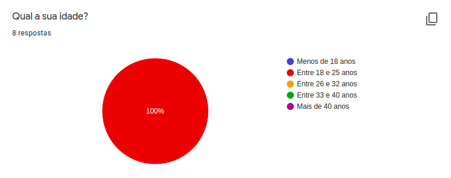
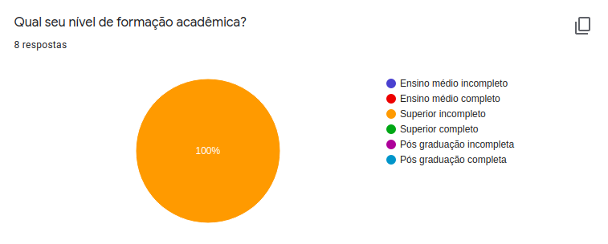
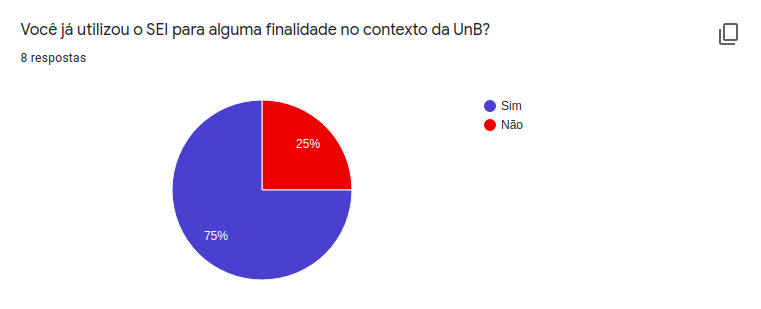
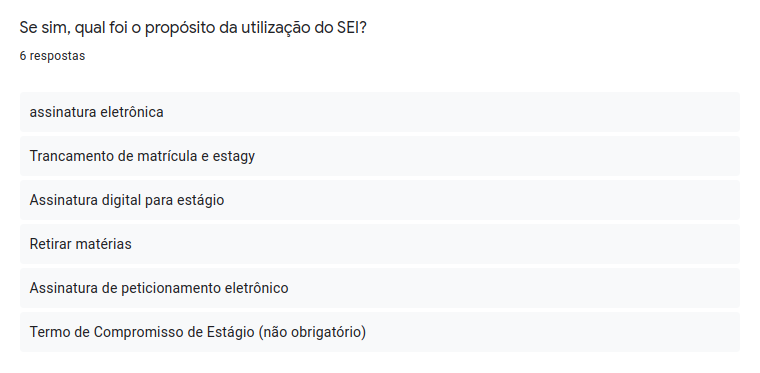
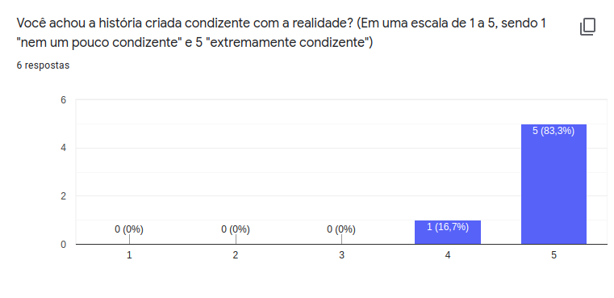
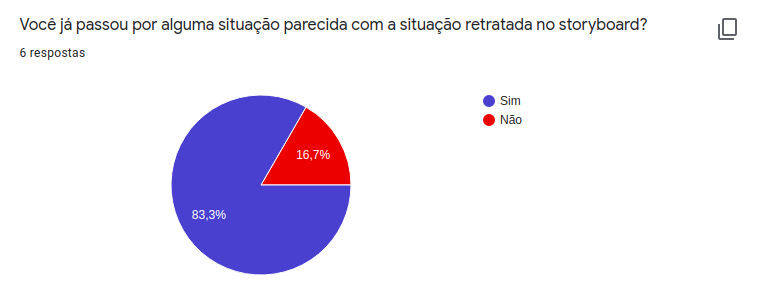
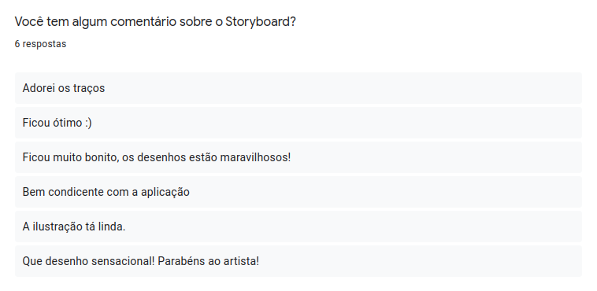

# Resultados da avaliação do storyboard

## Introdução

Neste documento reuniremos as pesquisas feitas para avaliar nosso storyboard para deixá-lo o mais fiel à realidade do [perfil de usuário](../../use_context/user_profiles.md) definido no projeto. Nesse documento, estará escrito os detalhes sobre a conclusão tomada pela equipe a partir da pesquisa e possíveis refatorações que serão feitas no [storyboard](../../use_context/storyboards.md).

Este documento, apresentará dados coletados de um formulário com o intuito de mensurar a qualidade do storyboard. O formulário foi feito pelo [google forms](https://docs.google.com/forms/u/0/) e as perguntas contidas neles podem ser vistas no documento de [planejamento](./evaluation/storyboard/planning) da avaliação do storyboard.

---

## Formulário

Inicialmente seria feito entrevistas para validar o storyboard, assim como feito para a análise de tarefas, porém foi notado que o storyboard necessita de uma abordagem de validação diferente uma vez que o mesmo representa de forma fictícia a interação do usuário com a plataforma, enquanto a análise de tarefas valida fluxo de funcionamento interno. Tendo isso em mente foi decidido que um formulário de validação do storyboard faria mais sentido, uma vez que ele não valida fluxo de utilização do usuário dentro do sistema.

O formulário é composto por 11 perguntas que começam com 3 perguntas de identificação da pessoa que está respondendo o formulário e continua avaliando se houve utilização ou não do SEI, o formulário se encerra caso o voluntário não tenha utilizado o SEI. Mais ao fim do formulário é avaliado a verossimilidade entre o storyboard e a experiência de uso do avaliador, assim como é oferecido um espaço para propor melhorias no storyboard existente.

É importante lembrar que todos os voluntários que responderam o formulário foram informados da utilização de suas respostas, assim como alguns dados pessoais para compor essa avaliação. Todos os detalhes foram apresentados através do [termo de consentimento](./evaluation/task_analysis/consent_form).

### Dados demográficos

Figura 1: Idade dos voluntários.

Figura 2: Nível acadêmico dos voluntários.

Analisando os dados demográficos podemos validar que o formulário foi respondido pelo público alvo esperado, jovens entre 18 e 25 anos cursando o ensino superior. É importante essa avaliação uma vez que estamos avaliando a utilização do SEI no contexto da UnB, tendo exatamente esse público como alvo e portanto melhorando a avaliação feita pelas outras perguntas do formulário, para assim averiguar a verossimilidade do storyboard.

### Análise do storyboard

Figura 2: Quantos voluntários já utilizaram o SEI.

Figura 2: Para qual propósito os voluntários utilizaram o SEI.

Para a avaliação ter resultados válidos para a pesquisa, é verificado o embasamento que cada voluntário carrega sobre a plataforma. Desta forma, pode ser observado que 75% dos voluntários utilizaram o SEI em diferentes perspectivas, trazendo diferentes situações de uso da plataforma. Esse dado se comporta positivamente para a pesquisa, já que diferentes visões da plataforma acarretam e múltiplas melhorias em diferentes pontos.

Figura 2: O storyboard condiz com a realidadde.

Figura 2: Verossimilidade do storyboard.

O ponto chave dessas duas perguntas está em validar o quão real o storyboard aborda dois aspectos diferentes, o contexto de utilização e a utilização em si, respectivamente. Podemos ver pelos resultados que ambos possuem uma boa validação por parte dos voluntários (83,3% e 66,7%, respectivamente) e que a representação de contexto foi mais bem elaborada do que a de utilização, possuindo um voto a mais.

Figura 2: Porcentagem de participantes que passaram por situações parecidas ao apresentados no storyboard.

Figura 2: Propostas de melhorias dos voluntários.

Figura 2: Comentários dos voluntários.

A partir dos dados apresentados, observa-se que 83,3% dos participantes já passaram por situações parecidas apresentadas no storyboard, o que nos confirma a tentativa positiva do storyboard ser o espelho da realidade dos estudantes. Com isso, podemos dizer que as propostas de melhorias dos voluntários seriam o ideal, entretando para a surpresa da equipe não foram apontados nenhum ponto de melhoria, o que nos traz um retorno agradável sobre o storyboard produzido, ainda mais com os comentários positivos feitos pelos mesmos.

---

## Conclusão

Dessa forma podemos observar que o storyboard possui uma boa similaridade com a realidade e portanto o valida como documento útil para o projeto eximindo assim a necessidade de reelaboração do mesmo. A partir disso podemos concluir que nossa persona, Maria Antonieta e o cenário apresentado no storyboard, representa com fidelidade a situação dos estudantes da Universidade de Brasília (UnB), principalmente nesse período de aulas EAD uma vez que tarefas como a retirada de matérias que poderia ser feito pessoalmente estão sendo feitas através do SEI.

---

## Referência

[1] BARBOSA, Simone; SILVA, Bruno. Interação Humano-Computador. Rio de Janeiro:Elsevier Editora Ltda, 2010.

---

## Histórico de versões

|    Data    | Versão |                          Descrição                          |            Autor(es)            |
| :--------: | :----: | :---------------------------------------------------------: | :-----------------------------: |
| 04/11/2020 |  0.1   | Criação da introdução do documento de resulto do storyboard | Leonardo Gomes e João Zarbielli |
| 05/11/2020 |  1.0   |                    Revisão do documento                     |  Leonardo Gomes e Victor Jorge  |
