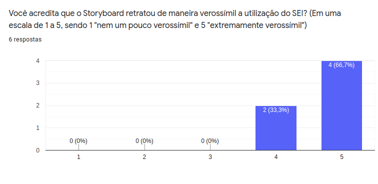

# Resultados da avaliação do storyboard

## Introdução

Neste documento reuniremos as pesquisas feitas para avaliar nosso storyboard para deixá-lo o mais fiel a realidade do [perfil de usuário](../../use_context/user_profiles.md) definido no projeto. Nesse documento, estará escrito os detalhes sobre a conclusão tomada pela equipe a partir da pesquisa e possíveis refatorões que serão feitas no [storyboard](../../use_context/storyboards.md).

Este documento, apresentará dados coletados de um formulário com o intuito de mensurar a qualidade do storyboard. O formulário foi feito pelo [google forms](https://docs.google.com/forms/u/0/) e as perguntas contidas neles podem ser vistas no documento de [planejamento](../planning.md) da avaliação do storyboard.

---

## Formulário

Inicialmente a ideia do grupo era fazermos entrevistas para validar os storyboards assim como feito para a análise de tarefas, porém percebemos que a análise de tarefas e os storyboards necessitam abordagens de validação diferentes uma vez que um deles valida fluxo de funcionamento interno, análise de tarefas, enquanto o outro representa de forma fictícia a interação do usuário com a plataforma, storyboard. Tendo isso em mente foi decidido que um formulário de validação dos storyboards faria mais sentido, uma vez que ele não valida fluxo de utilização do usuário dentro do sistema.

O formulário é composto por 11 perguntas que começam com 3 perguntas de identificação da pessoa que está respondendo o formulário e continua avaliando se ouve utilização ou não do SEI, o formulário se encerra caso o voluntário não tenha utilizado o SEI. Mais ao fim do formulário é avaliado a verossimilidade entre os storyboards e a experiência de uso do avaliador, assim como é oferecido um espaço para propor melhorias no storyboard existente.

É importante lembrar que todos os voluntários que responderam o formulário foram informados da utilização de suas respostas, assim como alguns dados pessoais para compor essa avaliação. Todos os detalhes foram apresentados através do [termo de consentimento](./consent_form.md).

### Dados demográficos

Figura 1: Idade dos voluntários.

Figura 2: Nível acadêmico dos voluntários.

Analisando os dados demográficos podemos validar que o formulário foi respondido pelo público alvo esperado, jovens entre 18 e 25 anos cursando o ensino superior. É importante essa avaliação uma vez que estamos avaliando a utilização do SEI no contexto da UnB, tendo exatamente esse público como alvo e portanto melhorando a avaliação feita pelas outras perguntas do formulário, para assim averiguar a verossimilidade do storyboard.

### Análise do storyboard

Figura 2: Quantos voluntários já utilizaram o SEI.

Figura 2: Para qual propósito os voluntários utilizaram o SEI.

Para a avaliação ter resultados validos para a pesquisa, é verificado o embasamento que cada voluntário carrega sobre a plataforma. Desta forma, pode ser observado, que 75% dos voluntários utilizaram o SEI em diferentes perspectivas, trazendo diferentes situações de uso da plataforma. Esse dado se comporta positivamente para a pesquisa, já que diferentes visões da plataforma acarretam e multiplas melhorias em diferentes pontos.

Figura 2: O storyboard condiz com a realidadde.

Figura 2: Verossimilidade do storyboard.

O ponto chave dessas duas perguntas está em validar o quão real o storyboartd aborda dois aspectos diferentes, o contexto de utilização e a utilização em si. A primeira pergunta valida o contexto enquanto a segunda a utilização. Podemos ver pelos resultados que ambos possuem uma boa validação por parte dos voluntários ( 88,3% e 66,7% respectivamente ) e que a representação de contexto foi mais bem elaborada do que a de utilização, possuindo um voto 5 a mais do que a de utilização.

Figura 2: Porcentagem de participantes que passaram por situações parecidas ao apresentados no storyboard.

Figura 2: Propostas de melhorias dos voluntários.

Figura 2: Comentários dos voluntários.

A partir dos dados apresentados, se observa que 83,3% dos participantes já passaram por situações parecidas apresentadas no storyboard, o que nos confirma a tentativa positiva do storyboard ser o espelho da realidade dos estudantes. Com isso, podemos dizer que as propostas de melhorias dos voluntários seriam o ideal, entretando para a surpresa da equipe, não foram apontados nenhum ponto de melhoria, o que nos traz um retorno agradável sobre o material produzido, ainda mais com os comentários positivos feitos pelos voluntários.

---

## Conclusão

---

## Referência

[1] BARBOSA, Simone; SILVA, Bruno. Interação Humano-Computador. Rio de Janeiro:Elsevier Editora Ltda, 2010.

---

## Históricos de versões

|    Data    | Versão |                          Descrição                          |            Autor(es)            |
| :--------: | :----: | :---------------------------------------------------------: | :-----------------------------: |
| 28/10/2020 |  0.1   | Criação da introdução do documento de resulto do storyboard | Leonardo Gomes e João Zarbielli |
