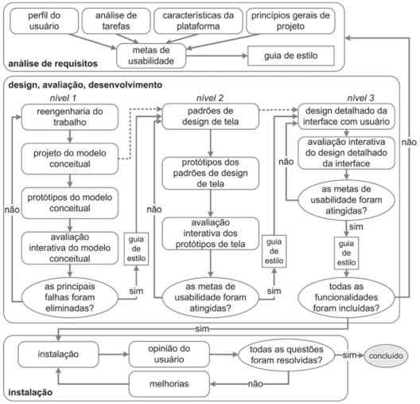

# Planejamento do projeto

## Cronograma de atividades

O cronograma tem como objetivo definir um planejamento das tarefas entregues e suas datas. A matéria (Interação Humano Computador da Univerdade de Brasília) por si só já tem um planejamento pré definido, sendo as datas de entrega chamadas de **ponto de controle**.

Após o debate sobre o planejamento, decidi-se adiantar algumas entregas definidas pelo professor, para se adequar melhor ao ciclo de vida do projeto. Dessa forma, nosso grupo separou as entregas em 4 pontos de controle:

### 1º Ponto de Controle - 21/09

Ponto de controle focado em avaliar o sistema, entender o problema, definir o escopo e fazer o planejamento da equipe e do projeto.

| Tarefa                       | Data da entrega | Data entregue |
| :--------------------------- | --------------- | ------------- |
| Avalição Heurística          | 11/09/2020      |               |
| Wiki                         | 11/09/2020      | 11/09/2020    |
| Guia de estilo               | 11/09/2020      | 09/09/2020    |
| Metas de Usabilidade         | 14/09/2020      |               |
| Princípios Gerais do projeto | 18/09/2020      |               |
| Planejamento da equipe       | 18/09/2020      | 14/09/2020    |
| Planejamento do projeto      | 18/09/2020      |               |

### 2º Ponto de Controle - 05/10

Ponto de controle com foco em identificar nosso usuário, fazer a análise de tarefas, entender a acessibilidade do projeto mais a fundo e finalizar a estilização do projeto.

| Tarefa                        | Data da entrega | Data entregue |
| :---------------------------- | --------------- | ------------- |
| Perfil do Usuário             | 25/09/2020      |               |
| Personas                      | 25/09/2020      |               |
| Análise de tarefas do usuário | 30/09/2020      |               |
| Guia de estilo                | 02/10/2020      |               |
| StoryBoarding (História)      | 02/10/2020      |               |
| Acessibilidade                | 02/10/2020      |               |

### 3º Ponto de Controle - 30/10

Ponto de controle focado em finalizar analise de tarefas, entender o processo de acessibilidade e fazer protótipo de baixa fidelidade.

| Tarefa                     | Data da entrega | Data entregue |
| :------------------------- | --------------- | ------------- |
| StoryBoarding (Desenho)    | 09/10/2020      |               |
| Reanalise de tarefas       | 09/10/2020      |               |
| Acessibilidade             | 09/10/2020      |               |
| Protótipo de papel         | 16/10/2020      |               |
| Avaliar protótipo de papel | 23/10/2020      |               |

### 4º Ponto de Controle - 22/11

Ponto de controle focado em fazer o protótipo de alta fidelidade e planejar melhorias para a entrega do projeto

| Tarefa                               | Data da entrega | Data entregue |
| :----------------------------------- | --------------- | ------------- |
| Protótipo de alta fidelidade         | 13/11/2020      |               |
| Entrevistas                          | 16/11/2020      |               |
| Avaliar protótipo de alta fidelidade | 18/11/2020      |               |
| Planejamento de melhorias            | 18/11/2020      |               |

---

## 5W2H

A utilização do framework 5W2H se faz necessário no entendimento do projeto, para mapear como, quando, onde, por quem, por que, o que e qual custo do sistema que será avaliado e sua equipe.

O 5W2H feito tem como objetivo trazer a perspectiva da equipe para elicitar ainda mais os objetivos da equipe e contexto em que o projeto está inserido.

| What                                                               | Why                                                                                  | Who                                                  | Where                                                   | When                                                     |
| :----------------------------------------------------------------- | ------------------------------------------------------------------------------------ | ---------------------------------------------------- | ------------------------------------------------------- | -------------------------------------------------------- |
| Sistema de produção e gestão de documentos e processos eletrônicos | Problemas na usabilidade, experiência de usuário e acessibilidade encontrados no SEI | Refatorado por discentes da Universidade de Brasília | Refatorado na disciplina de Interação Humano Computador | A refatoração será realizada no segundo semestre de 2020 |

| How                                                                                                                                                        | How much |
| :--------------------------------------------------------------------------------------------------------------------------------------------------------- | -------- |
| Por meio de métodos e processos já estruturados de design, avaliação de usabilidade, avaliação heurísticas e entre outros tópicos relevantes dentro do IHC | Gratuito |

---

## Ciclo de vida

Com uma visão holística, esse processo de design reúne e organiza diferentes atividades propostas na área de IHC para orientar o trabalho em direção a uma boa solução interativa.

Na fase de **análise de requisitos** são definidas as metas de usabilidade com base no perfil dos usuários, análise de tarefas, possibilidades e limitações da plataforma em que o sistema será executado e princípios gerais do design de IHC.

A fase de **design, avaliação e desenvolvimento** tem por objetivo conceber uma solução de IHC que atenda às metas de usabilidade estabelecidas na fase anterior.

Na fase de **instalação**, o grupo de trabalho deve coletar opiniões dos usuários depois de algum tempo de uso.

---

## Referências

[1] FERRAMENTAS DA QUALIDADE. NAPOLEÃO, Bianca. 5W2H, 10 agosto de 2018. Disponivel em: < https://ferramentasdaqualidade.org/5w2h/ >. Acesso em 16 de setembro, 2020.

[2] ENDEAVOR BRASIL. "5W2H: é hora de tirar as dúvidas e colocar a produtividade no seu dia a dia"; 08 de fevereiro, 2017. Disponível em < https://endeavor.org.br/pessoas/5w2h/ >. Acesso em 16 de setembro, 2020.

[3] BARBOSA, Simone; SILVA, Bruno. Interação Humano-Computador. Rio de Janeiro:Elsevier Editora Ltda, 2010.

---

## Históricos de versões

|    Data    | Versão |                Descrição                 |          Autor(es)           |
| :--------: | :----: | :--------------------------------------: | :--------------------------: |
| 10/09/2020 |  0.1   |    Criação do boilerplate do arquivo     | Hugo Sobral e Leonardo Gomes |
| 16/09/2020 |  0.2   |   Criação do cronograma de atividades    |        Leonardo Gomes        |
| 16/09/2020 |  0.3   |             Criação do 5W2H              | Hugo Sobral e Leonardo Gomes |
| 16/09/2020 |  1.0   | Refinamento do documento de planejamento | Leonardo Gomes e Hugo Sobral |
| 16/09/2020 |  1.1   |          Adição das referências          | Leonardo Gomes e Hugo Sobral |
| 17/09/2020 |  1.2   |           Correção ortográfica           | Hugo Sobral e Leonardo Gomes |
