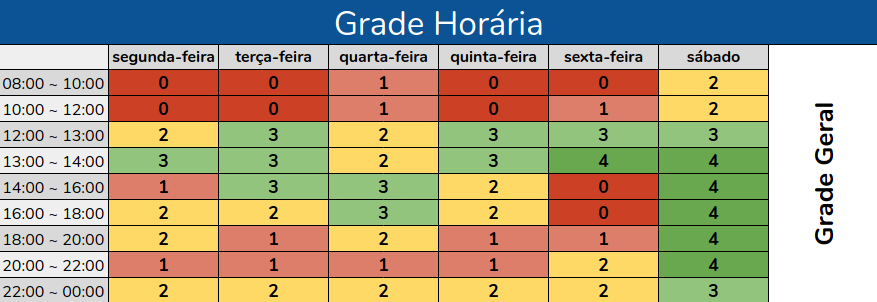

# Planejamento da equipe

## Heatmap

Heatmap é um mapa de calor, que na perspectiva do projeto, define horários acessíveis para encontros dos membros. Deste modo, utilizamos o Google Sheets para criar o heatmap da forma mais fácil. As cores quentes representam os dias menos propensos para reuniões e as cores frias os dias mais propensos.

---

## Metodologias

O projeto conta com várias metodologias que unidas formam a base de processo para a administração e consistência da agilidade do time.

### Scrum

A equipe decidiu por realizar os trabalhos a partir dos conceitos levantados pela metodologia ágil Scrum. Desta forma, nosso trabalho segue parte do fluxo existente dentro da metodologia, que vai desde a priorização das tarefas em um backlog geral, assim como a priorização de algumas das tarefas em um backlog relativo a Sprint em que o projeto se encontra; até a realização dos ritos da metodologia, Review e Retrospectiva.

#### Papéis

Os papéis no Scrum é um tipo de diretriz que associa um membro da equipe com um objetivo, assim direcionando a responsabilidade para respectivos pápeis/membros.

Após discussões, foi decidido não adotar nenhum papel do Scrum no projeto, tendo em vista o pequeno número de integrantes da equipe, que não facilita o uso desta abordagem.

#### Time-Box

Para estabelecer uma melhor organização da equipe, foi decidido, por meio da metodologia estabelecida, criar os dias e duração das reuniões de review/planning e os dias de daily.

| Review/Planning                                                                                                                                                                                                                                                                                                                         | Dailies                                                                                                                                                                                                                                                                               |
| :-------------------------------------------------------------------------------------------------------------------------------------------------------------------------------------------------------------------------------------------------------------------------------------------------------------------------------------- | :------------------------------------------------------------------------------------------------------------------------------------------------------------------------------------------------------------------------------------------------------------------------------------ |
| O Planning (reunião de planejamento de sprint) ocorrerá pelo Discord, e deverá contar com a presença de todos os integrantes. O Planning contará com um ata que tem como responsabilidade descrever todos os tópicos decididos na reunião, e esta tem horário marcado para todos os sábados às 15h00min e duração de no máximo 3 horas. | As Dailies (micro-reuniões realizadas com o intuito de informar à equipe o estado individual de cada membro), serão realizadas via Telegram de maneira remota às segundas, quartas e sextas. O horário das Dailies ficou definido para às 19h00min e duração no máximo de 15 minutos. |

### eXtreme Programming

Ficou acordado também que o grupo utilizará um dos princípios do Extreme Programming, também chamado de XP. Trata-se da Pair Programming, isto é, toda tarefa a ser realizada deverá ser feita por, no mínimo, dois integrantes do grupo.

### Kanban

Para o Kanban estamos utilizando o Trello para podermos usar a esquematização decidida pelo grupo:

- **Aulas Sincronas:** Lista as aulas síncronas irão ocorrer
- **Aulas Sincronas - Done:** Lista as aulas síncronas que já ocorreram
- **Entregas Individuais:** Lista de entregas individuais que devem ser feitas
- **Entregas Grupo:** Lista de entregas em grupo que devem ser feitas
- **Entregas - Done:** Lista de entregas (individuais e em grupo) que foram feitas.

---

## Políticas

Nesse tópico são explicados os procedimentos a serem feitos para que as políticas deste repositório sejam seguidas adequadamente.

### Políticas de Branch

Branches devem seguir as seguintes **regras** explicadas neste tópico:

- Breve explicação sobre o fluxo de trabalho
- A branch master representa uma versão estável do produto, contendo código já versionado.

Regras:

- Existe apenas uma branch master.
- Não são permitidos commits feitos diretamente na master.

As **branches feature** representam as entregas do projeto a serem desenvolvidas.

Regras:

- Essa branch sempre é criada a partir da branch master.
- Essa branch sempre é mesclada à branch master.

**Regras de nomenclatura:**

`issueID-titulo_da_issue`

### Políticas de Commits

Commits devem ser escritos de forma clara e breve, em inglês, descrevendo as alterações feitas.

**Regras** para escrita das mensagens nos commits:

`#issueID Mensagem breve descrevendo alterações`

Fix #issueID Concise Message

O caractere "#", por padrão, representa uma linha de comentário no arquivo de mensagem do commit. Para evitar problemas, é necessário alterar o caractere com o seguinte comando:

`git config --local core.commentChar auto`

Caso deseje utilizar um outro caractere específico para definir uma linha de comentário, basta substituir a palavra "auto" pelo caractere desejado.

A mensagem principal do commit deve ser escrita no **modo imperativo**. Aqui estão alguns exemplos:

Maus exemplos:

`Renamed the iVars and removed the common prefix.`

`Creating branch policies document`

Bons exemplos:

`Rename the iVars to remove the common prefix.`

`Create branch policies document`

---

## Ferramentas

O projeto conta com um ferramental composto por componentes de comunicação, organização de tarefas, armazenamento e também tecnologias orientadas à programação. Em meio às dificuldades da sociedade frente à pandemia, muitas ferramentas de comunicação remota, que antes desempenhavam o papel de facilitar o desenvolvimento do projeto, tornaram-se essenciais e primárias.

  <i class="fab fa-telegram-plane"></i>
  <i class="fab fa-google-drive"></i>
  <i class="fab fa-discord"></i>

  <i class="fab fa-trello"></i>
  <i class="fab fa-github"></i>

### Ferramentas de comunicação

Por conta da peculiaridade do estado de saúde em que vivemos atualmente, a escolha das ferramentas de comunicação foi baseada principalmente na qualidade e confiabilidade, afim de tornar a comunicação mais clara e assertiva.

#### Comunicação assíncrona

Como canal de comunicação assíncrona, a ferramenta escolhida foi o [Telegram](https://telegram.org/). Essa escolha se estabelece na superioridade do Telegram em relação a outras ferramentas de comunicação conhecidas (como o _WhatsApp_, por exemplo). No Telegram, encontra-se maior facilidade em gerenciar conversas em grupo, bem como compartilhar documentos e inserir _bots_ de apoio.

#### Comunicação síncrona

Durante os momentos iniciais de interação do grupo, foram encontradas diversas dificuldades em manter uma comunicação remota síncrona de qualidade. Dessa forma, dentre as ferramentas testadas ([_Meet_](https://meet.google.com/), [_Jitsi_](https://meet.jit.si/), [_Hangouts_](https://hangouts.google.com/) e [_Teams_](https://www.microsoft.com/pt-br/microsoft-365/microsoft-teams/group-chat-software/)), a que se mostrou mais adequada à rotina de trabalho e mostrou maior estabilidade foi o [_Discord_](https://discord.com/). Com o _Discord_ os integrantes conseguem comunicar entre si sempre que necessário sem maiores dificuldades.

### Ferramentas de organização

Sendo inegável a importância da organização em um projeto, a equipe adotou duas plataformas para auxiliar a organização das tarefas e dos produtos gerados durante o processo: o [_Trello_](https://trello.com/) e o [_GitHub_](https://github.com/).

Servindo como uma plataforma para organização de entregas, o Trello possibilita que sejam mapeadas e esquematizadas todas as tarefas a serem realizadas durante o projeto. Já o GitHub possibilita que todo o processo organizacional seja posto em prática, utilizando o sistema de versionamento e os componentes de comunicação entre os contribuidores (_Issues_ e _Pull Requests_). Tal coisa coisa permite que as evoluções estejam visíveis e sejam rastreáveis mesmo após a conclusão do projeto.

### Ferramentas de armazenamento

Muitas das atividades do projeto geram documentos como produto ou subproduto. Sendo assim, sentiu-se a necessidade de adotar ferramentas que possibilitam o armazenamento organizado, a modificação e a visualização coletiva desses documentos. Para manipular os documentos gerados como subprodutos e que são de interesse privado da equipe, escolheu-se o [_Google Drive_](https://www.google.com.br/drive/apps.html).

Com o google drive, os documentos ficam armazenados em nuvem e podem ser acessados pelos membros da equipe a qualquer momento e de qualquer lugar, tanto para visualização quanto para edição.

A principal ferramenta utilizada para o armazenamento dos documentos é o [_GitHub_](https://github.com/). Nele os documentos gerados como produtos durante o projeto são mantidos e tornados acessíveis ao público.

### Ferramentas de programação

Ao analisar a atividade de criação da apresentação dos instrumentos gerados durante o projeto, sentiu-se a necessidade de utilizar ferramentas de apoio que acrescentam maior qualidade e facilidade à tarefa. A decisão de qual ferramenta adotar se baseou na comparação direta entre o [_MkDocs_](https://www.mkdocs.org/) e o [_Docsify_](https://docsify.js.org/). Comparado ao _MkDocs_, o _Docsify_ oferece maior facilidade de uso e escolha de templates, o que permite que sejam entregues resultados semelhantes e até mesmo superiores investindo menos tempo. Por essas e outras razões o _Docsify_ foi a ferramenta adotada.

---

## Referências

[1] MEDEIROS, Manoel P; DEVMEDIA. "Extreme Programming – Conceitos e Práticas"; 2006. Disponível em < https://www.devmedia.com.br/extreme-programming-conceitos-e-praticas/1498 >. Acesso em 16 de setembro, 2020.

[2] SCRUMGUIDES. "The Scrum Guide". Disponível em < https://scrumguides.org/scrum-guide.html >. Acesso em 16 de setembro, 2020.

---

## Históricos de versões

|    Data    | Versão |                       Descrição                        |          Autor(es)           |
| :--------: | :----: | :----------------------------------------------------: | :--------------------------: |
| 10/09/2020 |  0.1   |           Criação do boilerplate do arquivo            | Hugo Sobral e Leonardo Gomes |
| 12/09/2020 |  0.2   |  Adição dos icones e estrutura básica das ferramentas  |        Leonardo Gomes        |
| 13/09/2020 |  1.0   | Criação do esclarecimento das escolhas das ferramentas |      Victor Jorge Silva      |
| 14/09/2020 |  1.1   |    Criação e estruturação do tópico de metodologias    |        Leonardo Gomes        |
| 14/09/2020 |  2.0   | Criação da política do repositório e adição do Heatmap |        Leonardo Gomes        |
| 17/09/2020 |  2.1   |                  Correção ortográfica                  | Hugo Sobral e Leonardo Gomes |

