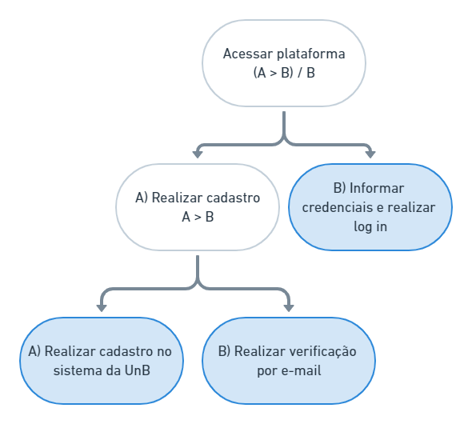
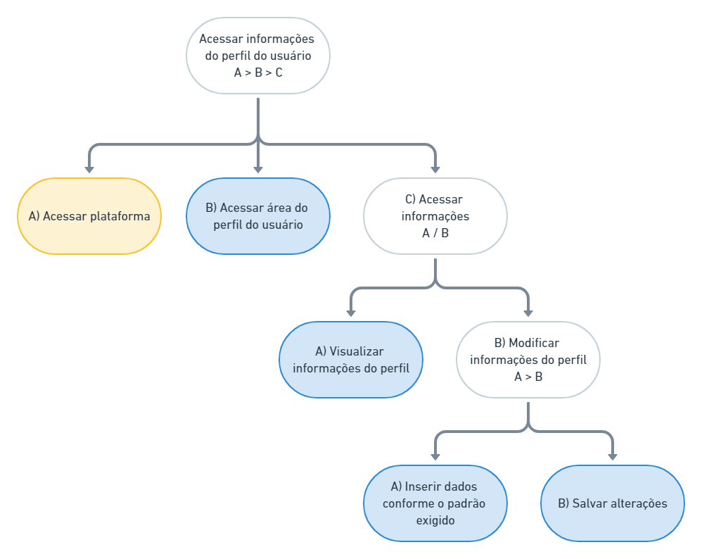

# Construção de tarefas

## Introdução

Notou-se a necessidade de um documento que expresse as tarefas desejadas no processo de redesign da interface. A análise das tarefas, neste contexto, foi elaborada a fim de fornecer suporte ao processo de síntese de protótipos que satisfaçam os critérios de usabilidade. As análises de tarefas aqui contidas estão expressas através do método _HTA_ (_Hierarchical Task Analysis_).

## Padrões de diagramação

Considerando os princípios do _HTA_, estabele-se os seguintes elementos visuais e textuais:

### Objetivo e operação

### Relação entre subobjetivos

> **A > B | sequêncial**: subobjetivo **A** é cumprido antes do subobjetivo **B**.
>
> **A / B | seleção**: cumpre-se o subobjetivo **A** ou o subobjetivo **B**.
>
> **A + B | paralelo**: subobjetivo **A** é cumprido paralelamente ao subobjetivo **B**.

## Acessar plataforma

Esta tarefa consiste no acesso à plataforma por parte do usuário

### Diagrama

### Tabela

| objetivos/operações                                   | problemas e recomendações                 |
|:-----------------------------------------------------:|:-----------------------------------------:|
| Acessar plataforma (A > B) / B                        | _plano_: Realizar cadastro e informar credenciais e realizar _log in_, ou apenas informar credenciais e realizar _log in_ |
| A) Realizar cadastro A > B                            | _plano_: Realizar cadastro no sistema da UnB, realizar verificação por e-mail |
| A.A) Realizar cadastro no sistema da UnB              | _recomendação_: Deixar claro ao usuário que o cadastro será feito em uma plataforma que não é o _SEI!_;  _feedback_: No _SEI!_, ao solicitar novo cadastro, fornecer novas orientações para prosseguir o cadastro; _problema_: A área de cadastro foge do domínio da plataforma |
| A.B) Realizar verificação por e-mail                  | _acao_: Enviar por _e-mail_ todas as instruções necessárias para realizar o primeiro _log in_ |
| B) Informar credenciais e realizar _log in_           | ---                                       |

## Peticionamento de processo

### Diagrama

### Tabela

| objetivos/operações                                   | problemas e recomendações                 |
|:-----------------------------------------------------:|:-----------------------------------------:|
| Peticionar um processo A > (B / C) > D                | _input_: Informações pessoais e sobre o processo acrescido de arquivos digitalizados   _feedback_: O processo deve gerar notificações aos interessados e manter atualizado seu status   _plano_: Conseguir acesso a plataforma, criar novo processo ou reanimar processo intercorrente, e submeter peticionamento   _recomendação_: Fornecer informações relevantes ao usuário durante todo o processo |
| A) Conseguir acesso a plataforma                      | ---                                       |
| B) Criar novo processo A > B > C                      | _plano_: Escolher tipo do processo, inserir as informações textuais, e fazer upload de documentos digitalizados   _feedback_: Informar o usuário sobre os padrões a serem adotados na submissão de dados |
| B.A) Escolher tipo do processo                        | _recomendação_: oferecer maneiras eficientes de filtragem de opções   _feedback_: Mostrar breve informações sobre cada opção |
| B.B) Inserir informações textuais                     | _recomendação_: evitar uso de jargões na nomeação dos campos, ou explicar em palavras comuns cada campo   |
| B.C) Realizar uplaod de documentos                    | _feedback_: Informar o usuário sobre o formato de arquivo adotado e seu limite de tamanho   Recomendação: evitar restrições demasiadas (ex.: aceitar apenas PDF ou limite de tamanho muito apertado) |
| C) Projeto intercorrente                              | _plano_: Escolher tipo do processo, e informar número do processo |
| C.A) Escolher tipo do processo                        | similar ao item B.A                       |
| D) Submenter peticionamento                           | _recomendação_: Notificar cada parte envolvida sobre atualizações, a fim de evitar retardos na comunicação |

## Acessar os recibos eletrônicos

Esta tarefa consiste na requisição e acesso aos recibos eletrônicos de protocolo gerados em peticionamentos.

### Diagrama

### Tabela

| objetivos/operações                                   | problemas e recomendações                 |
|:-----------------------------------------------------:|:-----------------------------------------:|
| Acessar os recibos eletrônicos A > B                  | _input_: Credenciais de acesso ao sistema   _plano_: Acessar a plataforma, acessar área de recibos eletrônicos |
| A) Acessar plataforma                                 |  --                                       |
| B) Acessar área de recibos eletrônicos A > B          | _plano_: Aplicar filtros de data e tipo de peticionamento, pesquisar recibos |
| B.A) Aplicar filtros de data e tipo de peticionamento | _recomendação_: Restringir a seleção de data e tipos de processos (prevenir inserção de dados inválidos)   _feedback_: Deixar claro ao usuário que se trata de filtros |
| B.B) Pesquisar recidos                                | --                                        |

## Acessar informações do perfil do usuário

Esta tarefa consiste no acesso às informações do perfil do usuário e, possivelmente, suas respectivas alterações

### Diagrama

### Tabela

| objetivos/operações                                   | problemas e recomendações                 |
|:-----------------------------------------------------:|:-----------------------------------------:|
| Acessar informações do perfil do usuário A > B > C    | _input_: Credenciais de acesso ao sistema;   _plano_: Acessar a plataforma, acessar área do perfil do usuário, acessar informações;   _feedback_: Alterações que necessitam de aprovação devem ser sinalizadas como pendentes |
| A) Acessar plataforma                                 | ---                                       |
| B) Acessar área do perfil do usuário                  | _recomendação_: Dispor de um botão intuitivo |
| C) Acessar informações A / B                          | _plano_: Visualizar informações do perfil ou modificar informações do perfil |
| C.A) Visualizar informações do perfil                 | _recomendação_: Posicionar as informações de forma lógica e coesa sem ambiguidades |
| C.B) Modificar informações de perfil A > B            | _plano_: Inserir dados conforme o padrão exigido, salvar alterações  |
| C.B.A) Inserir dados conforme o padrão exigido        | _recomendação1_: Limitar a formar de inserir dados a fim de prevenir inserção de dados inválidos;   _recomendação2_: Deixar claro ao usuário qual padrão deve ser seguido em campos onde não há possibilidade de aplicar restrições;   _problema_: Depender do bom senso do usuário para inserir dados importantes pode ser potencialmente perigoso |
| C.B.B) Salvar alterações                              | _feedback_: Mostrar como pendente as atualizações que precisam de validação humana |

## Referências

[1] BARBOSA, Simone; SILVA, Bruno. Interação Humano-Computador. Rio de Janeiro: Elsevier Editora Ltda, 2010.

## Histórico de versões

|    Data    | Versão |             Descrição             |          Autor(es)           |
| :--------: | :----: | :-------------------------------: | :--------------------------: |
| 31/10/2020 | 1.0    | Versão incial do documento        | Victor Silva                 |
