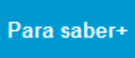
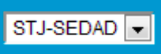
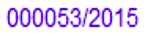
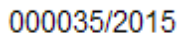
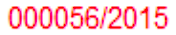
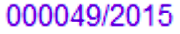
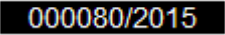
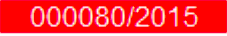

# Guia de Estilo

Guia de estilo tem como foco estabelecer métricas de conformidade e identidade para símbolos, cores, formas e layouts.

---

## Proposta de Guia de Estilo

A proposta de guia de estilo apresenta diferentes cores para serem exploradas em diferentes componentes na plataforma, o que possibilita apresentar uma variedade de contraste não apenas entre branco e preto, mas entre as próprias cores. Além disso, a proposta tenta trazer um novo estilo para a logo e uma padronização consolidada dos componenetes.

### Manual de Identidade Visual

O manual de identidade visual resume aspectos visuais gerais da plataforma, sem aprofundar em aplicações para o mesmo. Neste sentido são apresentadas a assinatura, as cores e a tipografia do sistema.

A abordagem da logo traz uma identidade para a plataforma. A assinatura é inspirada nos aspectos funcionais do sistema: documentação, artigos e processos. Desta forma, a logo representa um documento dobrado (uma folha de papel dobrada), com apenas uma cor que pode variar em fundos monocromáticos ou coloridos.

<embed src="./assets/pdf/manual_de_identidade_visual.pdf" width="800px" height="500px" />
Figura 1: Apresentação do novo manual de identidade visual proposto

### Aplicações

As aplicações foram padronizadas e devem ser utilizadas conforme o guia de componentes. Desta forma, uma conformidade satisfatória com a plataforma é alcançada.

<embed src="./assets/pdf/aplicacoes.pdf" width="800px" height="500px" />
Figura 2: Apresentação das aplicações dos componentes

### Conformidade de elementos

Conjunto de elementos que seguem um padrão definido pelo design que pode ser visto por toda a plataforma, a conformidade de elementos na proposta de guia de estilo se baseia na biblioteca [fontawasome](https://fontawesome.com), que agrega todos os icones necessário para aplicação, já esbelecendo um padrão de icones na plataforma e seguindo o padrão de mercado, dessa forma trazendo mais entendimento e familiaridade para o usuário.

---

## Atual Guia de Estilo

O atual guia de estilo do SEI é composto por apenas duas cores e uma logo simplista sem nenhum aspecto que possa soar como uma real assinatura da plataforma.

As cores definidas não são exploradas com sucesso na plataforma, muitas delas só aparecem no header e na logo. Além disso apenas uma cor tem o contraste bom com a cor branca, mas mesmo assim são utilizadas cores de pouco contraste sobrepostas, desta forma a acessibilidade fica comprometida.

<embed src="./assets/pdf/atual_manual_de_identidade_visual.pdf" width="800px" height="500px" />
Figura 3: Apresentação do atual manual de identidade visual do sei

### Conformidade de elementos

Conjunto de elementos que seguem um padrão definido pelo design que pode ser visto por toda a plataforma, a conformidade de elementos no atual SEI se dá por icones ilustrativos feitos pelos próprios designers, sem a utilização de qualquer biblioteca, assim trazendo um aspecto mais único a página, mas podendo confudir o usuário por não seguir padrões de mercado.

---

### Barra de ferramentas

| Ícones                                                                                                 | Descrição                                                                                                                                    |
| :----------------------------------------------------------------------------------------------------- | :------------------------------------------------------------------------------------------------------------------------------------------- |
|                        | **Para saber +:** Disponibiliza uma lista de vídeos com o passo a passo de várias funcionalidades do SEI.                                    |
|                                    | **Menu:** Permite ocultar ou mostrar o Menu Principal.                                                                                       |
|                            | **Pesquisa:** Realiza pesquisa livre.                                                                                                        |
|        | **Caixa de seleção de Unidade:** Mostra a unidade em que o usuário está logado e permite a navegação pelas unidades nas quais tem permissão. |
|  | **Controle de Processos:** Retorna à página inicial.                                                                                         |
|                          | **Novidades:** Canal de comunicação entre os gestores do sistema e os usuários.                                                              |
|                              | **Usuário:** Mostra o usuário que está logado.                                                                                               |
|   | **Configurações do Sistema:** Permite alterar o esquema de cores do sistema.                                                                 |
|              | **Sair do Sistema:** Permite sair com segurança do sistema.                                                                                  |

---

### Tela Controle de Processos

| Ícones e Orientações visuais                                                                      | Descrição                                                                                                                                                               |
| :------------------------------------------------------------------------------------------------ | :---------------------------------------------------------------------------------------------------------------------------------------------------------------------- |
|                        | **Login entre parênteses:** Indica o usuário a quem o processo foi atribuído na unidade.                                                                                |
|                     | **Processo com número em preto:** Indica que já foi acessado por algum usuário da unidade.                                                                              |
|              | **Processo com número em vermelho:** Indica que ainda não foi acessado.                                                                                                 |
|        | **Processo com número em azul:** Indica que foi acessado e/ou que sofreu alguma ação realizada pelo usuário por login/sessão.                                           |
|  | **Processo com fundo preto:** Indica processo sigiloso já acessado por alguém da unidade. Só pode ser visto por usuários com credencial de acesso ao processo sigiloso. |
|           | **Processo com fundo vermelho:** Indica processo sigiloso que ainda não foi acessado                                                                                    |
|                 | **Processo com fundo azul:** Indica que o processo sigiloso foi acessado e/ou que sofreu alguma ação realizada pelo usuário por login/sessão.                           |
|       | Indica que o processo remetido para sua unidade tem prazo de retorno programado a vencer.                                                                               |
|                | Indica que o processo remetido para sua unidade está com prazo de retorno programado expirado (atrasado).                                                               |
|               | Indica que um documento do processo foi publicado.                                                                                                                      |
|                | Indica que houve a inclusão de um novo documento no processo ou que um documento (externo ou interno) foi assinado.                                                     |
|                 | Indica a existência de uma anotação simples.                                                                                                                            |
|              | Indica a existência de uma anotação com prioridade.                                                                                                                     |
|                | Alerta o usuário de que existe um documento sigiloso (com credencial) para ser assinado.                                                                                |

---

## Referências

[1] Manual de Identidade Visual do grupo Stock de Desenho de Software da Universidade de Brasília - https://github.com/UnBArqDsw/2020.1_G12_Stock

[2] How to create a visual style guide for your brand - https://bit.ly/3lyAq42

[3] STJ - Guia prático do SEI: sistema eletrônico de informações - https://ww2.stj.jus.br/publicacaoinstitucional/index.php/guiasei/article/view/3291/3232

---

## Histórico de versões

|    Data    | Versão |                Descrição                |   Autor(es)    |
| :--------: | :----: | :-------------------------------------: | :------------: |
| 09/09/2020 |  1.0   | Criação do Manual de Identidade Visual. | Leonardo Gomes |
| 09/09/2020 |  1.1   |   Criação dos documentos Aplicações.    | Leonardo Gomes |
| 12/09/2020 |  1.2   | Criação da descrição do Guia de Estilo. | Leonardo Gomes |
| 23/09/2020 |  1.3   | Adição do atual guia de estilo do SEI.  | Leonardo Gomes |
| 02/10/2020 |  1.4   |     Adição da descrição das figuras     |  Hugo Sobral   |
| 02/10/2020 |  1.4   |    Adição de confirmadade de icones     | Leonardo Gomes |
