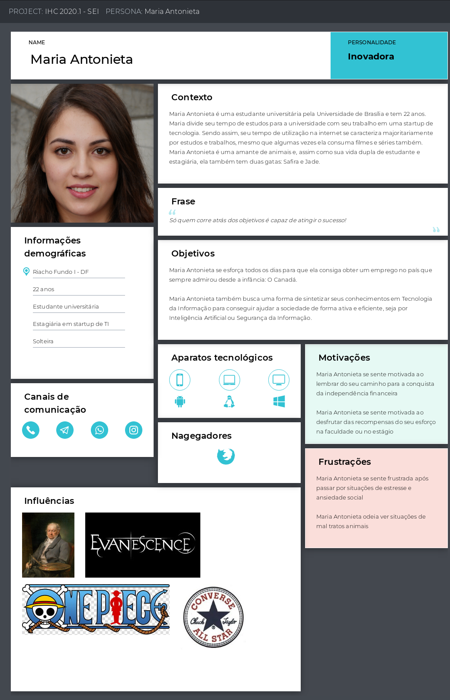
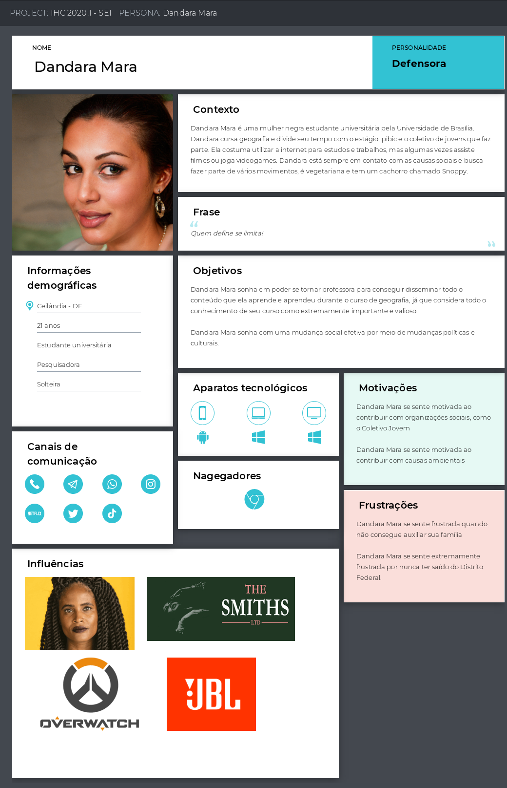
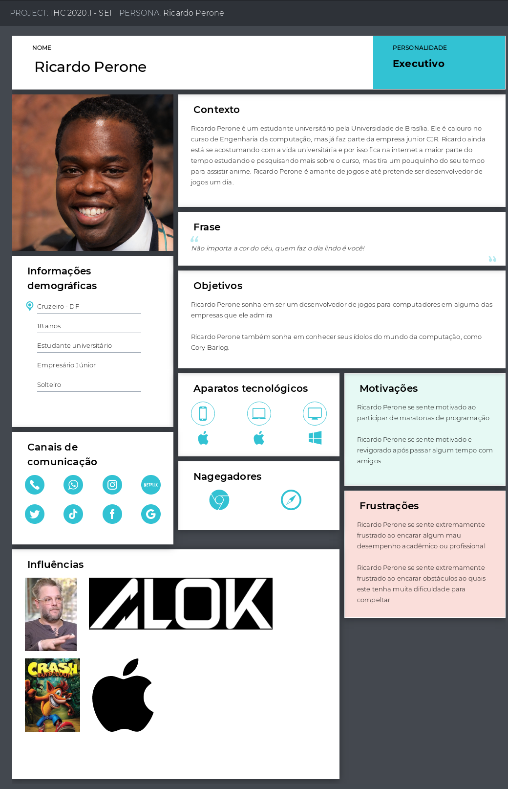
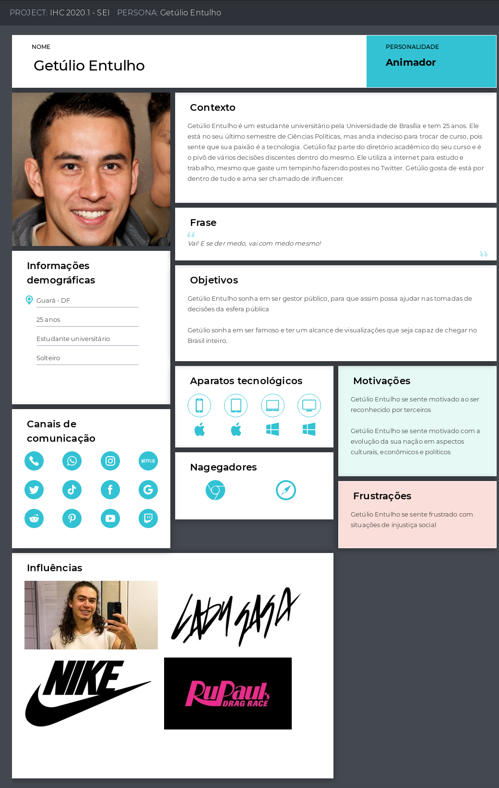
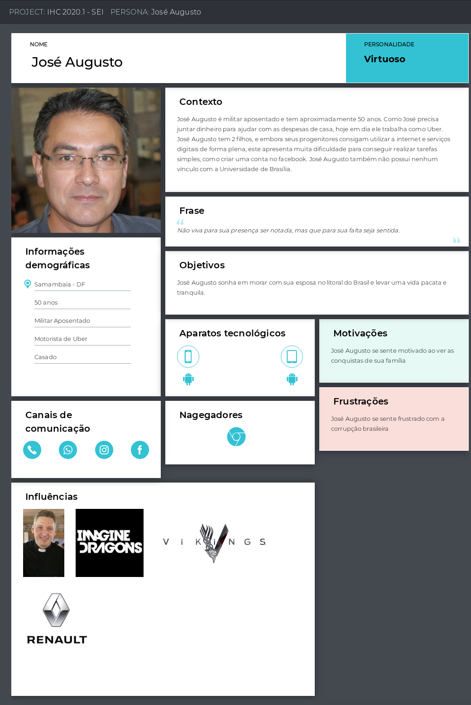

# Personas

Uma persona é um personagem fictício, arquétipo hipotético de um grupo de usuá-rios reais, criada para descrever um usuário típico (Cooper et al., 2007; Pruitt e Adlin, 2006; Cooper, 1999). As personas são definidas principalmente por seus objetivos, que são determinados num processo de refinamentos sucessivos durante a investigação inicial do domínio de atividade do usuário.

Desta forma, nós utilizamos as personas para descrever e representar um grupo de usuários finais com a finalidade de auxiliar no desenvolvimento do processo de design.

---

## Personas Primárias

Trata-se do indivíduo que é o foco principal do design.

Figura 1: Maria Antonieta, persona principal do projeto

---

## Personas Secundárias

Trata-e do indivíduo que se encaixa como usuário da aplicação mas não é o foco principal do processo de design.

Figura 2: Dandara Mara, persona secundária do projeto

Figura 3: Ricardo Perone, persona secundária do projeto

Figura 4: Getúlio Entulho, persona secundária do projeto

---

## Antipersona

São personas definidas com o propósito de ilustrar o exato oposto ao usuário principal, isto é, um arquétipo que não é considerado um usuário do sistema e que não deve ser o foco do processo de design.

Figura 5: José Augusto, antipersona do projeto

---

## Referências

[1] BARBOSA, Simone; SILVA, Bruno. Interação Humano-Computador. Rio de Janeiro:Elsevier Editora Ltda, 2010.

[2] Uxpressia: Customer & User Journey MAP (CJM). Disponível em < https://uxpressia.com/ > Acesso em 30 de setembro de 2020

[3] This Person Does Not Exist. Disponível em: < https://thispersondoesnotexist.com/ > Acesso em 30 de setembro de 2020

[4] Tipos de Personalidade. Disponível em: < https://www.16personalities.com/br/descricoes-dos-tipos > Acesso em 30 de setembro de 2020

---

## Históricos de versões

|    Data    | Versão |             Descrição             |          Autor(es)           |
| :--------: | :----: | :-------------------------------: | :--------------------------: |
| 10/09/2020 |  0.1   | Criação do boilerplate do arquivo | Hugo Sobral e Leonardo Gomes |
| 30/09/2020 |  1.0   |      Confecção das personas       | Hugo Sobral e Leonardo Gomes |
