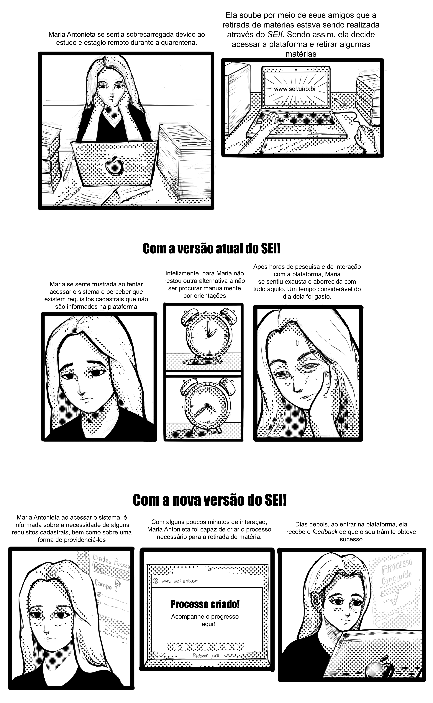

# Storyboards

### Introdução

O documento de _Storyboard_ consiste em quadros desenhados dispostos sistematicamente com o objetivo de narrar uma história fictícia de interação do usuário com a plataforma. Neste documento são destacados de forma visual os objetivos futuros e as atuais limitações da interface da plataforma _SEI!_.

### Storyboard

Neste storyboard, é apresentada a _persona_ Maria Antonieta em um episódio de seu dia a dia, no qual ela se encontra em uma situação onde o uso do _SEI!_ se torna algo necessário. Este _Storyboard_ procura explicitar o impacto da utilização do sistema sobre o usuário, i.e., como ele se sente ao utilizar a aplicação.

## Históricos de versões

|    Data    | Versão |             Descrição             |          Autor(es)           |
| :--------: | :----: | :-------------------------------: | :--------------------------: |
| 10/09/2020 |  0.1   | Criação do boilerplate do arquivo | Hugo Sobral e Leonardo Gomes |
| 11/10/2020 | 1.0 | Criação do Storyboard | Victor Silva |
