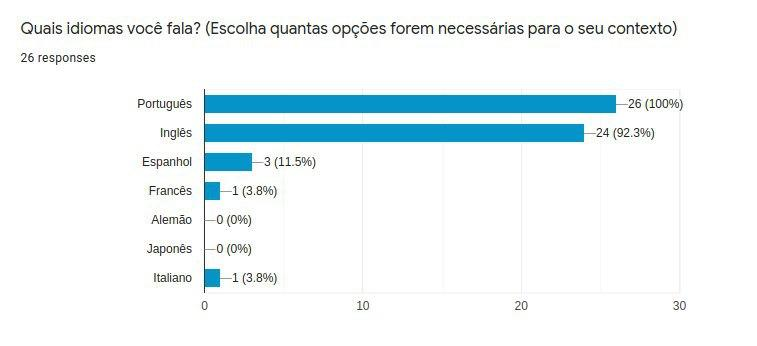

# Perfis de usuário

O perfil de usuário é uma forma de estabelecer características a respeito dos usuários dentro do contexto da aplicação, a fim de definir funcionalidades, estética e conformidade para a aplicação.

A partir da perspectiva do nosso projeto, o Sistema Eletrônico de Informação voltado para a Universidade de Brasília, nós do grupo criamos um formulário por meio da ferramenta _Google Forms_ para responder a questão "Quem é o usuário do SEI?".

Esse formulário criado tem como objetivo coletar informações de diferentes naturezas acerca de pessoas que utilizam o SEI com frequência ou já apresentaram algum uso no âmbito universitário.

Figura 1: Pergunta "Você utiliza o SEI?" do formulário

Como é possível observar pela imagem, o formulário alcançou 35 pessoas diferentes.

---

## Informações demográficas

Figura 2: Pergunta sobre idade dos usuários

Figura 3: Pergunta sobre gênero dos usuários

Figura 4: Pergunta sobre localidade dos usuários

Figura 5: Pergunta sobre idiomas falados pelos usuários

---

## Informações profissionais

Figura 6: Pergunta sobre a profissão dos usuários

Figura 7: Pergunta sobre a situação financeira dos usuários

---

## Relação com a tecnologia

Figura 8: Pergunta sobre a familiaridade dos usuários com a tecnologia

Figura 9: Pergunta sobre o uso da internet pelos usuários

Figura 10: Pergunta sobre dificuldades enfrentadas pelos usuáriso ao utilizar o SEI

---

## Conclusão

Com base nos dados coletados por meio do formulário, pode-se traçar um perfil de usuário para o Sistema Eletrônico de Informação voltado para processos da Universidade de Brasília.

- A idade dos usuários varia entre **18 a 25 anos**
- O gênero dos usuários está distribuido, majoritariamente, entre **homens e mulheres cis**
- Os usuários residem no **Distrito Federal**
- Os usuários são **falantes de português**
- Os usuários são **estudantes universitários**
- Os usuários **trabalham de alguma forma, seja autônoma ou empregatícia**
- Os usuários **conseguem usar sistemas para computador de forma plena**
- Os usuários usam a internet **para trabalho e estudos**

## Históricos de versões

|    Data    | Versão |             Descrição             |          Autor(es)           |
| :--------: | :----: | :-------------------------------: | :--------------------------: |
| 10/09/2020 |  0.1   | Criação do boilerplate do arquivo | Hugo Sobral e Leonardo Gomes |
| 30/09/2020 |  1.0   |   Criação do perfil de usuário    | Hugo Sobral e Leonardo Gomes |
